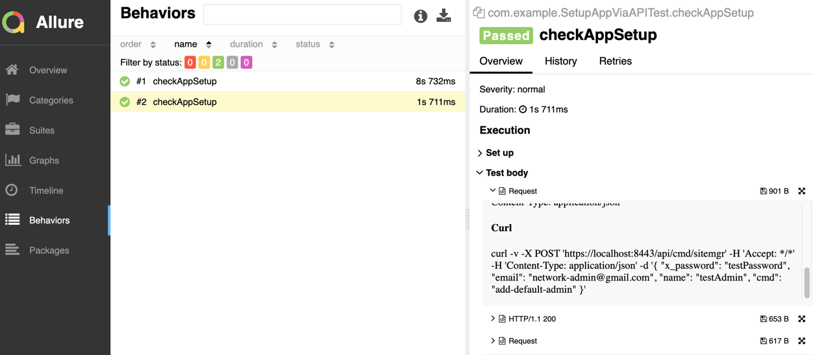

# UniFi Network Application Tests

This project automates the setup and verification of the **UniFi Network Application**.

---

## Prerequisites

Before you begin, ensure you have the following installed on your machine:

- **Java Development Kit (JDK) 17** or higher
- **Maven** (for dependency management and build)
- **Docker** (for running the UniFi Network Application)
- **Chrome Browser** (if using ChromeDriver for tests)
- **ChromeDriver** (ensure it matches your Chrome version, or let Selenide manage it automatically)

---

## Project Structure


- **pom.xml**: Maven configuration file with project dependencies.
- **BaseTest.java**: Contains setup and teardown methods for the tests.
- **SetupAppViaAPITest.java**: Contains API test cases.
- **SetupAppViaUITest.java**: Contains UI test cases.
- **testng.xml**: Configuration file for TestNG test suites.
- **testng.xml**: Configuration file for TestNG test suites.
- **AppContainerController.java**: Allows to start and stop docker during the test execution
- **UnifiApiClient.java**: API client for unifi endpoints
- **com/example/ui**: Package contains page objects and components for ui tests
- **app.properties**: Property file contains default data for the unifi app

---

## Installation

### 1. Clone the Repository

```bash
git clone https://github.com/yzerk/network-app-tests.git
cd network-app-tests
```

### 2. Start the UniFi Network Application

#### Using Docker

```bash
docker compose up -d 
```
This command pulls and runs the UniFi Network Application in a Docker container.

### 3. Install Project Dependencies

Ensure you are in the project directory and run:

```bash
mvn clean install
```
This command will download all necessary dependencies and build the project.

## Install chromedriver
Open Terminal and run the following command to install ChromeDriver:
```bash
brew install --cask chromedriver
```
Check chromedriver version. It should be compatible with your chrome
```bash
chromedriver --version
```

#### Handling macOS Security Warnings:

Check ChromeDriver path
```bash
which chromedriver
```
run the following command to bypass the MacOS security check
```bash
xattr -d com.apple.quarantine /usr/local/bin/chromedriver
```
where `/usr/local/bin/chromedriver` is the path returned by command `which chromedriver`


## Running the Tests

### 1. Run All Tests

```bash
mvn test
```

### 2. Run Specific Tests

You can run specific tests by modifying the `testng.xml` file or by using Maven's test filtering options.

#### Using `testng.xml`

Edit the `testng.xml` file to include only the tests you want to run. For example:

```xml
<?xml version="1.0" encoding="UTF-8"?>
<!DOCTYPE suite SYSTEM "https://testng.org/testng-1.0.dtd">
<suite name="NetworkAppTestSuite">
  <test name="NetworkAppTests">
    <classes>
      <class name="com.example.SetupAppViaUITest"/>
      <class name="com.example.SetupAppViaAPITest"/>
    </classes>
  </test>
</suite>
```

#### Using Maven Command Line

You can also run specific tests using Maven's `-Dtest` option:

Run all tests in a class:

```bash
mvn test -Dtest=SetupAppViaUITest
```
### 3. Allure Report
Generate report
```bash
mvn allure:report
```
Open report
```bash
mvn allure:serve
```
this command should open report in default browser.


---

## Technologies Used

- **Java 21**
- **Maven**: Dependency management and build tool
- **Selenide**: Simplifies browser automation for web UI tests
- **Rest-Assured**: Simplifies testing of REST APIs
- **Awaitility**: a library which provides a simple domain-specific language (DSL) for asynchronous systems testing.
- **AssertJ**: Provides fluent assertions for better readability
- **TestNG**: Testing framework for running and managing tests
- **Allure**: Reporting tool for displaying test execution results
- **Docker**: Containerization for running the UniFi Network Application

---

## Configuration Details

### Selenide Configuration

- **Browser**: Chrome (default)
- **Browser Size**: Maximized (`Configuration.browserSize = "maximize"`)
- **Accept Insecure Certificates**: Enabled to interact with the application over HTTPS with self-signed certificates
- **Headless Mode**: Disabled by default (`Configuration.headless = false`)

### Rest-Assured Configuration

- **Base URI**: `https://127.0.0.1:8443`
- **Relaxed HTTPS Validation**: Enabled to bypass SSL certificate validation for self-signed certificates

### UniFi Network Application Access

- **Web UI**: Accessible at `https://127.0.0.1:8443`
- **API Endpoints**: Available under `https://127.0.0.1:8443/api/`

---

## Additional Notes

- **Credentials**: The tests use default credentials (`admin` / `password`). Adjust as needed.
- **Selectors**: Ensure that the XPATH selectors used in the tests match the actual elements in the application.
- **Browser Drivers**: If not letting Selenide manage drivers automatically, ensure that the appropriate driver (e.g., ChromeDriver) is installed and added to your system's PATH.
- **SSL Certificates**: The application uses self-signed certificates. The configurations in the tests handle SSL issues.

---
